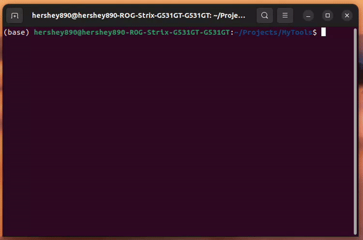

# Python Pomodoro
A command line version of the famous Pomodoro method timer. The program plays a ringer at the end of each study interval.  
- 25 min study time
- 4 x 25 min study intervals
- 5 minute short break
- 25 minute long break  
- intervals modifiable in config.json

## Requirements
- Python 3 (I used 3.12)
- If not on Windows, the `playsound` package is recommended. Without it, a beep at the end of each study/break interval may not occur. To install use `pip install playsound` or `conda install conda-forge::playsound`

## Usage
```Shell
$ python pomodoro.py
Press Enter to pause the timer.
Work time (0) | Time Total: 25:00 | Time Elapsed: 00:06
```


Want to make it more convenient? Add the program to your system path for example add `export PYTHONPATH=$PYTHONPATH:<path to folder>/Pomodoro` to your `~/.profile` file and use `sudo chmod +x pomodoro.py` (adds execution rights to the file) to call the file directly with `pomodoro.py` from any directory on your machine.